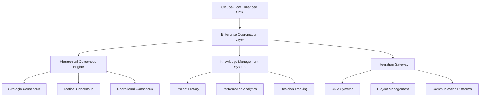
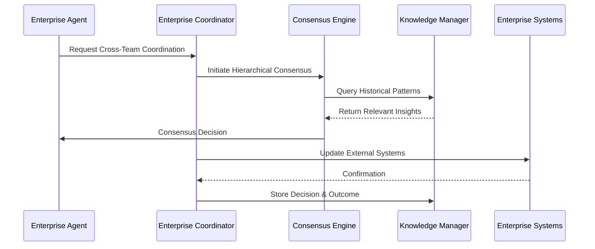

# 🔧 Claude-Flow Enhancement Requirements

## Product Requirements Document (PRD)

**Document Type**: Feature Request / Enhancement PRD  
**Target System**: Claude-Flow MCP Framework  
**Requesting Team**: KaskMan Autonomous Platform  
**Priority**: High  
**Timeline**: Q2-Q3 2025  

---

## 📋 **Executive Summary**

KaskMan's evolution into an enterprise autonomous software platform requires enhanced Model Context Protocol (MCP) tools for sophisticated AI agent coordination, organizational simulation, and enterprise-scale hive mind operations. This document outlines specific feature requirements for claude-flow to support enterprise autonomous software development.

### **Key Enhancement Areas**
1. **Enterprise Organizational Coordination**
2. **Advanced Multi-Level Consensus Mechanisms**
3. **Persistent Organizational Memory Systems**
4. **Enterprise Integration & API Connectors**
5. **Performance & Scalability Improvements**

---

## 🎯 **Business Justification**

### **Current Limitations**
- Basic swarm coordination insufficient for enterprise teams (50+ agents)
- Limited organizational hierarchy support
- No persistent organizational memory
- Insufficient enterprise system integration
- Basic consensus mechanisms inadequate for complex decisions

### **Business Impact**
- **Market Opportunity**: $50B+ enterprise software development market
- **Customer Need**: 300+ enterprise customers requiring advanced AI coordination
- **Revenue Impact**: $10M+ ARR potential from enterprise features
- **Competitive Advantage**: First-to-market autonomous organizational simulation

---

## 🔧 **Detailed Feature Requirements**

### **1. Enterprise Organizational Coordination**

#### **1.1 Hierarchical Agent Management**
```typescript
interface EnterpriseHierarchy {
  organizationId: string;
  hierarchy: {
    executives: ExecutiveAgent[];
    managers: ManagerAgent[];
    teams: TeamStructure[];
    individuals: IndividualAgent[];
  };
  reportingStructure: ReportingRelationship[];
  decisionAuthority: DecisionMatrix;
}

interface ExecutiveAgent extends Agent {
  role: 'CEO' | 'CTO' | 'VP_Engineering' | 'VP_Product';
  decisionScope: 'strategic' | 'tactical' | 'operational';
  reportingTeams: string[];
  budgetAuthority: number;
}
```

**MCP Tool Requirements:**
```json
{
  "tool_name": "enterprise_hierarchy_manager",
  "capabilities": [
    "create_organizational_structure",
    "assign_reporting_relationships",
    "manage_decision_authority",
    "coordinate_cross_team_initiatives",
    "escalate_decisions_up_hierarchy"
  ],
  "inputs": {
    "organization_config": "OrganizationalConfig",
    "hierarchy_definition": "HierarchyStructure",
    "role_definitions": "RoleDefinition[]"
  },
  "outputs": {
    "hierarchy_status": "HierarchyStatus",
    "coordination_metrics": "CoordinationMetrics",
    "escalation_path": "EscalationPath"
  }
}
```

#### **1.2 Cross-Functional Team Coordination**
```typescript
interface CrossFunctionalCoordination {
  projectId: string;
  involvedTeams: {
    frontend: FrontendTeam;
    backend: BackendTeam;
    qa: QATeam;
    devops: DevOpsTeam;
    design: DesignTeam;
  };
  coordinationMechanisms: {
    standups: StandupConfiguration;
    sprints: SprintCoordination;
    reviews: ReviewProcess;
    deployments: DeploymentCoordination;
  };
}
```

**MCP Tool Requirements:**
```json
{
  "tool_name": "cross_team_coordination",
  "capabilities": [
    "coordinate_sprint_planning",
    "manage_cross_team_dependencies",
    "resolve_inter_team_conflicts",
    "optimize_workflow_handoffs",
    "track_cross_team_metrics"
  ],
  "real_time_features": [
    "live_coordination_updates",
    "conflict_detection_alerts",
    "bottleneck_identification",
    "automatic_escalation"
  ]
}
```

### **2. Advanced Multi-Level Consensus Mechanisms**

#### **2.1 Hierarchical Consensus System**
```typescript
interface HierarchicalConsensus {
  levels: {
    strategic: StrategicConsensus;    // Executive decisions
    tactical: TacticalConsensus;      // Team lead decisions  
    operational: OperationalConsensus; // Individual task decisions
  };
  escalationRules: EscalationRule[];
  conflictResolution: ConflictResolutionStrategy[];
  timeoutHandling: TimeoutStrategy;
}

interface StrategicConsensus {
  participants: ExecutiveAgent[];
  decisionType: 'budget_allocation' | 'strategic_direction' | 'resource_planning';
  consensusThreshold: number;
  timeLimit: Duration;
  fallbackMechanism: 'executive_override' | 'delayed_decision' | 'stakeholder_input';
}
```

**MCP Tool Requirements:**
```json
{
  "tool_name": "hierarchical_consensus_engine",
  "capabilities": [
    "initiate_multi_level_consensus",
    "manage_consensus_workflows",
    "handle_consensus_escalation",
    "resolve_consensus_conflicts",
    "track_decision_effectiveness"
  ],
  "consensus_algorithms": [
    "byzantine_fault_tolerant",
    "weighted_voting",
    "expertise_based_consensus",
    "stakeholder_priority_consensus"
  ]
}
```

#### **2.2 Federated Consensus for Multi-Tenant**
```typescript
interface FederatedConsensus {
  organizations: OrganizationNode[];
  sharedDecisions: {
    platformUpdates: PlatformDecision[];
    resourceSharing: ResourceSharingDecision[];
    standardsAlignment: StandardsDecision[];
  };
  isolationBoundaries: IsolationRule[];
  crossOrgProtocols: CrossOrgProtocol[];
}
```

### **3. Persistent Organizational Memory Systems**

#### **3.1 Enterprise Knowledge Graph**
```typescript
interface EnterpriseKnowledgeGraph {
  organizationId: string;
  knowledgeDomains: {
    projectHistory: ProjectHistoryNode[];
    teamPerformance: PerformanceNode[];
    decisionHistory: DecisionNode[];
    skillMatrix: SkillNode[];
    processKnowledge: ProcessNode[];
  };
  relationships: KnowledgeRelationship[];
  accessControl: KnowledgeAccessControl;
}

interface ProjectHistoryNode {
  projectId: string;
  timeline: ProjectTimeline;
  outcomes: ProjectOutcome[];
  lessons: LessonLearned[];
  metrics: ProjectMetrics;
  artifacts: ProjectArtifact[];
}
```

**MCP Tool Requirements:**
```json
{
  "tool_name": "enterprise_knowledge_manager",
  "capabilities": [
    "store_organizational_knowledge",
    "query_knowledge_graph",
    "extract_insights_from_history",
    "recommend_based_on_patterns",
    "maintain_knowledge_consistency"
  ],
  "storage_requirements": {
    "persistence": "long_term",
    "scalability": "enterprise_scale",
    "performance": "sub_second_queries",
    "security": "enterprise_grade"
  }
}
```

#### **3.2 Continuous Learning System**
```typescript
interface ContinuousLearning {
  learningDomains: {
    agentPerformance: AgentLearning[];
    processOptimization: ProcessLearning[];
    decisionEffectiveness: DecisionLearning[];
    teamDynamics: TeamLearning[];
  };
  learningAlgorithms: LearningAlgorithm[];
  adaptationMechanisms: AdaptationMechanism[];
}
```

### **4. Enterprise Integration & API Connectors**

#### **4.1 Standardized Enterprise Connectors**
```typescript
interface EnterpriseIntegrations {
  crmSystems: {
    salesforce: SalesforceConnector;
    hubspot: HubSpotConnector;
    pipedrive: PipedriveConnector;
  };
  projectManagement: {
    jira: JiraConnector;
    linear: LinearConnector;
    asana: AsanaConnector;
    monday: MondayConnector;
  };
  communication: {
    slack: SlackConnector;
    teams: TeamsConnector;
    discord: DiscordConnector;
  };
  versionControl: {
    githubEnterprise: GitHubEnterpriseConnector;
    gitlab: GitLabConnector;
    bitbucket: BitbucketConnector;
  };
}
```

**MCP Tool Requirements:**
```json
{
  "tool_name": "enterprise_integration_manager",
  "capabilities": [
    "manage_system_connections",
    "sync_data_across_systems",
    "handle_authentication",
    "manage_rate_limiting",
    "provide_unified_apis"
  ],
  "integration_patterns": [
    "webhook_based",
    "polling_based", 
    "event_driven",
    "real_time_streaming"
  ]
}
```

#### **4.2 Compliance & Security Integration**
```typescript
interface ComplianceIntegration {
  frameworks: {
    soc2: SOC2Compliance;
    gdpr: GDPRCompliance;
    hipaa: HIPAACompliance;
    iso27001: ISO27001Compliance;
  };
  auditTrails: AuditTrailSystem;
  dataGovernance: DataGovernanceSystem;
  accessControls: EnterpriseAccessControl;
}
```

### **5. Performance & Scalability Improvements**

#### **5.1 High-Performance Agent Coordination**
```typescript
interface HighPerformanceCoordination {
  scalingLimits: {
    maxAgents: 1000;
    maxConcurrentTasks: 10000;
    maxOrganizations: 100;
  };
  performanceTargets: {
    coordinationLatency: '< 100ms';
    consensusTime: '< 5 seconds';
    knowledgeQueryTime: '< 50ms';
    memoryPersistence: 'real-time';
  };
  optimizationStrategies: {
    caching: CachingStrategy;
    loadBalancing: LoadBalancingStrategy;
    sharding: ShardingStrategy;
  };
}
```

**MCP Tool Requirements:**
```json
{
  "tool_name": "performance_optimization_engine",
  "capabilities": [
    "monitor_system_performance",
    "optimize_agent_coordination",
    "manage_resource_allocation",
    "predict_scaling_needs",
    "auto_scale_infrastructure"
  ],
  "performance_metrics": [
    "coordination_latency",
    "throughput_metrics",
    "resource_utilization",
    "error_rates",
    "user_experience_metrics"
  ]
}
```

---

## 📊 **Implementation Specifications**

### **Technical Requirements**

#### **API Specifications**
```typescript
// Enhanced MCP Protocol Extensions
interface EnhanceMCPProtocol {
  version: "2.0";
  extensions: {
    enterpriseCoordination: EnterpriseCoordinationExtension;
    hierarchicalConsensus: HierarchicalConsensusExtension;
    persistentMemory: PersistentMemoryExtension;
    enterpriseIntegration: EnterpriseIntegrationExtension;
  };
}
```

#### **Data Models**
```typescript
interface EnterpriseAgent extends BaseAgent {
  organizationId: string;
  role: EnterpriseRole;
  hierarchy: HierarchyPosition;
  capabilities: EnterpriseCapability[];
  performance: PerformanceMetrics;
  learning: LearningState;
}

interface EnterpriseDecision {
  id: string;
  type: DecisionType;
  level: 'strategic' | 'tactical' | 'operational';
  participants: AgentParticipant[];
  process: DecisionProcess;
  outcome: DecisionOutcome;
  effectiveness: EffectivenessMetrics;
}
```

### **Security Requirements**

#### **Access Control**
- **Role-Based Access Control (RBAC)**: Fine-grained permissions based on organizational roles
- **Multi-Tenant Isolation**: Complete isolation between different organizations
- **Audit Logging**: Comprehensive audit trails for all actions and decisions
- **Data Encryption**: End-to-end encryption for all sensitive data

#### **Compliance Requirements**
- **SOC 2 Type II**: Security, availability, and confidentiality controls
- **GDPR**: Data protection and privacy controls for EU operations
- **HIPAA**: Healthcare data protection for healthcare customers
- **ISO 27001**: Information security management standards

### **Performance Requirements**

#### **Scalability Targets**
- **Agent Coordination**: Support 1000+ simultaneous agents per organization
- **Consensus Performance**: < 5 second consensus for complex decisions
- **Knowledge Queries**: < 50ms response time for knowledge graph queries
- **Real-time Updates**: < 100ms latency for real-time coordination updates

#### **Reliability Targets**
- **Uptime**: 99.9% availability (8.76 hours downtime/year)
- **Fault Tolerance**: Byzantine fault tolerance for consensus mechanisms
- **Data Consistency**: Strong consistency for critical organizational data
- **Disaster Recovery**: RTO < 15 minutes, RPO < 5 minutes

---

## 🔄 **Integration Architecture**

### **System Architecture**


### **Data Flow Architecture**


---

## 📈 **Success Metrics & Validation**

### **Performance Metrics**
- **Coordination Efficiency**: 95%+ successful multi-team coordination
- **Consensus Speed**: < 5 seconds for complex organizational decisions
- **Knowledge Retrieval**: < 50ms average query response time
- **System Reliability**: 99.9% uptime with enterprise SLA

### **Business Metrics**
- **Enterprise Adoption**: 50+ enterprise customers using enhanced features
- **Feature Utilization**: 80%+ usage of advanced coordination features
- **Customer Satisfaction**: 90%+ satisfaction with enterprise features
- **Cost Efficiency**: 40% reduction in coordination overhead

### **User Experience Metrics**
- **Learning Curve**: < 2 weeks for team onboarding
- **Task Completion**: 25% faster task completion with enhanced coordination
- **Decision Quality**: 30% improvement in decision effectiveness
- **Agent Performance**: 20% improvement in individual agent productivity

---

## 🚀 **Implementation Roadmap**

### **Phase 1: Foundation (Months 1-2)**
- [ ] Enhanced MCP protocol specification
- [ ] Basic enterprise hierarchy support
- [ ] Simple multi-level consensus implementation
- [ ] Core knowledge management system

### **Phase 2: Core Features (Months 3-4)**
- [ ] Full hierarchical consensus engine
- [ ] Cross-team coordination mechanisms
- [ ] Enterprise integration framework
- [ ] Persistent organizational memory

### **Phase 3: Advanced Features (Months 5-6)**
- [ ] Performance optimization engine
- [ ] Advanced compliance features
- [ ] Federated consensus for multi-tenant
- [ ] Real-time analytics and monitoring

### **Phase 4: Enterprise Readiness (Months 7-8)**
- [ ] Enterprise security hardening
- [ ] Scalability testing and optimization
- [ ] Comprehensive documentation
- [ ] Customer pilot program

---

## 💡 **Innovation Opportunities**

### **AI/ML Enhancements**
- **Predictive Coordination**: ML models to predict coordination bottlenecks
- **Adaptive Consensus**: Dynamic consensus algorithms based on context
- **Intelligent Escalation**: AI-powered decision escalation recommendations
- **Performance Optimization**: Continuous learning for coordination improvement

### **Advanced Features**
- **Virtual Reality Coordination**: 3D visualization of organizational coordination
- **Natural Language Interface**: Voice and text commands for coordination
- **Mobile Coordination**: Native mobile apps for on-the-go coordination
- **API Marketplace**: Third-party integrations and extensions

---

## 📋 **Deliverables & Acceptance Criteria**

### **Code Deliverables**
- [ ] Enhanced MCP protocol implementation
- [ ] Enterprise coordination tools (5 new MCP tools)
- [ ] Comprehensive test suite (>95% coverage)
- [ ] Performance benchmarking suite
- [ ] Documentation and examples

### **Documentation Deliverables**
- [ ] Technical specifications
- [ ] API documentation
- [ ] Integration guides
- [ ] Best practices documentation
- [ ] Migration guides from current version

### **Acceptance Criteria**
- [ ] All performance targets met in load testing
- [ ] Security audit passed with no critical findings
- [ ] Successfully coordinate 100+ agents in test environment
- [ ] Customer pilot program shows 90%+ satisfaction
- [ ] Full backward compatibility with existing MCP tools

---

## 🤝 **Collaboration & Support**

### **KaskMan Team Commitment**
- **Development Resources**: 2 senior engineers for integration work
- **Testing Resources**: Comprehensive testing with 50+ enterprise scenarios
- **Documentation**: Complete integration documentation and examples
- **Support**: 24/7 support during initial deployment phase

### **Required Claude-Flow Team Support**
- **Architecture Review**: Joint architecture review sessions
- **Code Review**: Collaborative code review process
- **Testing**: Joint testing and validation
- **Documentation**: Collaborative documentation efforts

### **Timeline & Milestones**
- **Month 1**: Requirements finalization and architecture agreement
- **Month 2-4**: Core development and testing
- **Month 5-6**: Integration testing and optimization
- **Month 7-8**: Customer pilot and production deployment

---

**Document Version**: 1.0  
**Prepared By**: KaskMan Enterprise Development Team  
**Reviewed By**: Enterprise Architecture Team  
**Approved By**: CTO Office  
**Last Updated**: 2025-07-10  

This PRD represents a comprehensive enhancement request to support KaskMan's evolution into an enterprise-grade autonomous software platform. The proposed features would position claude-flow as the leading framework for enterprise AI coordination and organizational simulation.